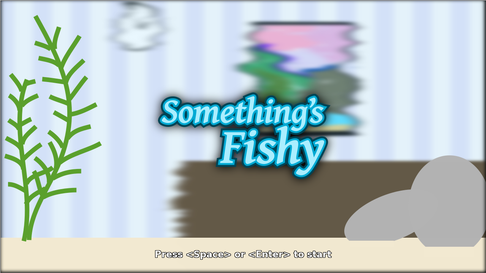
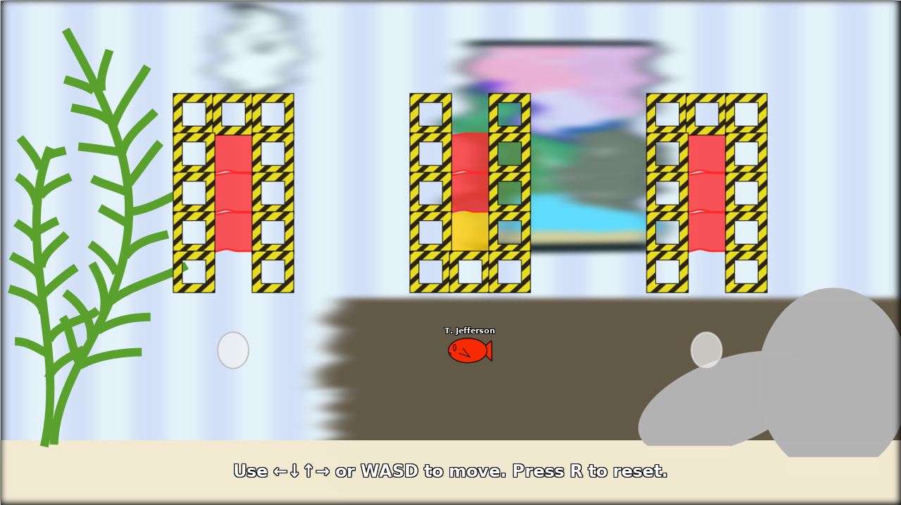

# Something’s Fishy

One of America’s Founding Fathers has been turned into a fish! This is
unfortunate, but there’s nothing you can do about it right now. Instead, help
him investigate why blobs of color that should be purple are actually yellow and
red!!

## Prerequisites

* Python 3.5+ (I think, but I only tested on Python 3.6)

## Setup

* Clone the repo.

    ```
    $ git clone https://github.com/kalgynirae/somethings-fishy.git
    $ cd somethings-fishy
    ```

* Create a virtualenv and install the package.

    ```
    $ python3 -m venv env
    $ env/bin/pip install -e .
    ```

* Run the game.

    ```
    $ env/bin/python -m game
    ```

## Screenshots




